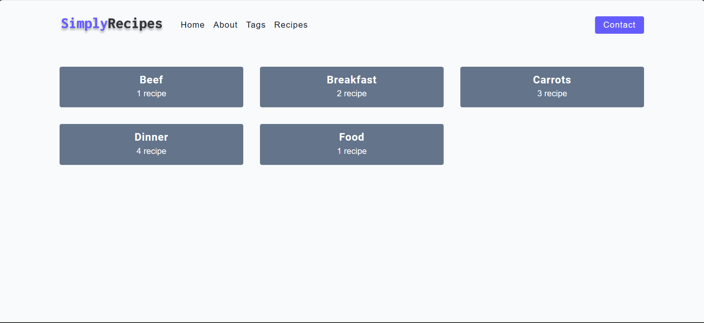

# Recipe

This is a simple Recipes page created by HTML and CSS


## Demo

### 1. Home Page


### 2. Recipe Types


## Run Locally


Clone the project

```bash
  git clone https://github.com/Zumarepasha/pacewisdom-projects.git
```

Run the File

```bash
  index.html
```


## Credits

This script is created by Zumare Pasha.

Feel free to contribute to this project or suggest improvements. If you encounter any issues, please report them in the issues section.
